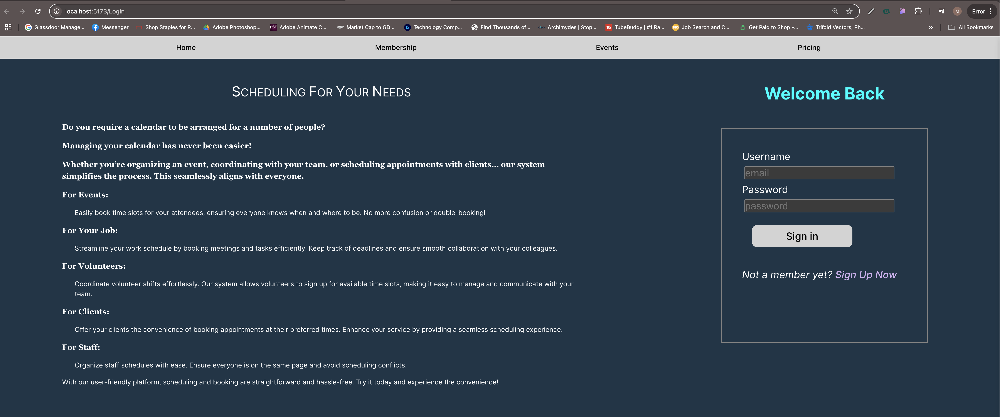
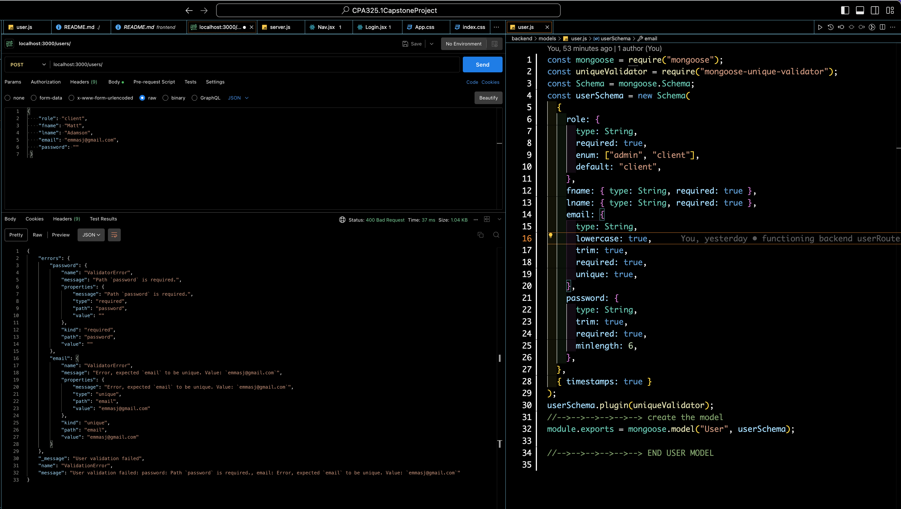
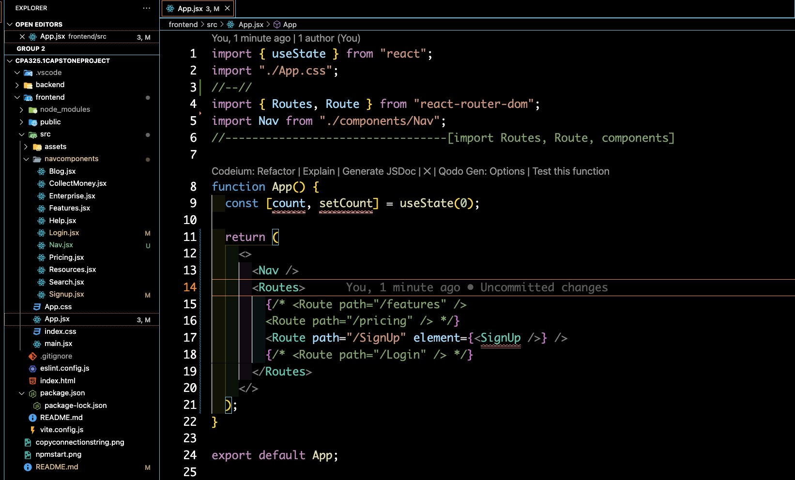
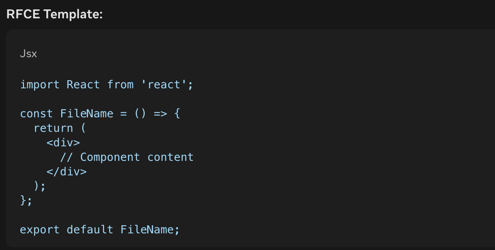

#  🇺🇸  CPA325.1 Capstone Project  🇺🇸
===================================
```
Author: Michael Marquez
Project: PerScholas Capstone
```
# Capstone Landing Page

#Capstone Membership Page


## Initial Commit [ ✅ ]
-----------------
```
mkdir CPA325.1CapstoneProject
mkdir 
    CPA325.1CapstoneProject/frontend 
    CPA325.1CapstoneProject/backend
cd CPA325.1CapstoneProject
    git init at this level
    git add .
    git commit -m ''
    git remote add origin <repo>
    where <repo> = https://github.com/MM-BYC/CPA325.1CapstoneProject
    git push -u origin main
```
## Backend 
-----------------
### Create Server  [ ✅ ]
 
```
1. cd backend
    ▶️ npm init -y
    ▶️ npm i express mongoose dotenv nodemon   
    
2. create server.js
   ▶️ const express= require('express')
   ▶️ const app = express()
   ▶️ const PORT = process.env.PORT || 3000
   ▶️ app.listen(PORT,()=>{
        console.log(`Listening on port: ${PORT}`)
3. Edit package.json 
   ▶️ "start": "node server.js",
   ▶️ "dev"" "nodemon server.js"
4. create .env
   ▶️ PORT= 
5. Test server is running.
   ▶️ npm start
```

### Test the Server [ ✅ ] 


### Establish Database [ ✅ ]
```
1. create folder config
    1.1. create file connectToDb
        ▶️ require("dotenv").config()
        ▶️ const mongoose = require('mongoose');
        ▶️ const connectToDb = async() => {
            await mongoose.connect(process.env.DB_URL);
            console.log(`DataBase_Connected`)
        }
        ▶️ module.exports = connectToDb
2. edit .env  
    Manually copy the connection string from mongoose
    ▶️ DB_URL=mongodb+srv://<username>>:<password>@cluster0.scklh.mongodb.net/appName=capstoneProject 
```


```
3. edit server.js
    ▶️ const connectToDb = require('./config/connectToDb')
    ▶️ connectToDb()
```

### Data Models
```    
Field validation can enforce "unique" with a library mongoose-unique-validator 
At the backend root folder
    ▶️ npm i mongoose-unique-validator

Inside the model e.g. user.js include these:

(Place at the top)
    ▶️ const uniqueValidator = require("mongoose-unique-validator");

(Place at the bottom before module.exports)
    ▶️ userSchema.plugin(uniqueValidator);
```
### Mongoose-Unique-validator
```
Error is catch for:
    Password is required
    email must be unique
```


```

4. create folder models
    4.1 create file user.js     
        // stores related user information   
        ▶️ const mongoose = require("mongoose");
        ▶️ const Schema = mongoose.Schema;
        ▶️ const userSchema = new Schema({
            role: {type: String,enum: ["admin", "user"]},
            name: {type: String, required: true},
            email: {type: String, unique: true},
            password: {type: String, minlength: 6}
        })

    4.2 create file opendate.js
    // stores related booked informations   
        ▶️ const mongoose = require("mongoose");
        ▶️ const Schema = mongoose.Schema;
        ▶️ const userSchema = new Schema({

            })
        ▶️ const User = mongoose.model("user", userSchema);
        ▶️ module.exports = User;
```

### Make Controllers [ ✅ ]

```
1. create folder controllers
    1.1 create openController.js
    
    1.2 create userController.js
```

### Make Routes [ ✅ ]
```
1. create folder routes
    1.1 Create file userRoute.js

    1.2 Create file openRoute.js
```

## Frontend
-----------

### Install React, cors [ ✅ ]

```
1. cd frontend
    ▶️ npm create vite@latest .
    ▶️ npm install 
    ▶️ npm run dev 
2.  Connect frontend and backend with:
    2.1. Proxy goes to the frontend package.json
        ▶️"proxy": "http://localhost:3000",
    2.2. Go to the Backend
        ▶️ npm install cors
    2.3.  Backend server.js 
        ▶️ const cors = require('cors')
        ▶️ app.use(
                cors({
                    origin: true,
                    credentials: true,}));  
```
### Install react-router-dom
```
* BrowserRouter is the top-level router component.
* Routes is the container for all Route components. Think <ul>
* Route defines individual routes.                  Think <li>

1. cd frontend
    ▶️ npm install react-router-dom
2.  inside index.js 
    ▶️ import { BrowserRouter } from "react-router-dom";
    
    Wrap App component within.

    ▶️ <StrictMode>
       <BrowserRouter>
        <App />
       </BrowserRouter>
         {/* wrapping our app in BrwserRtr allows us to use LINK ROUTE ROUTES SWITCH components */}
      </StrictMode>

3. Inside App.jsx
    // Import Route and our components
    ▶️ import { Route, Routes } from "react-router-dom";
    ▶️ import Nav from "./components/Nav";
    
    Build React Router's route
```



### RFCE = React Functional Component 


```
 Use fragment "<> </>" as the top level below the return statement.

4. Inside Nav.jsx
    ▶️ RFCE first
    { Link } allows users to navigate between routes without full page reloads.
    How Link to="/settings" recognizes Route path="/settings":
    React Router's Link component and Route component work together to enable client-side routing.
    Here's how it works:
    -------------------    
    * Link component specifies the to prop, which is the URL path to navigate to (e.g., /settings).
    * React Router's Route component specifies the path prop, which matches the URL path.
    * When the user clicks the Link, React Router checks the to prop against the path props of all Route components.
    * If a match is found, React Router renders the corresponding element prop (e.g., `<Settings logo={logo.settings}/>).
``` 