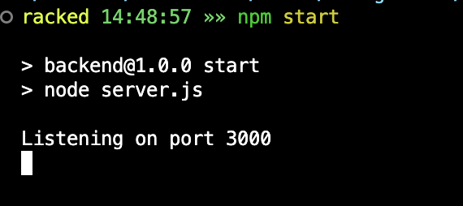
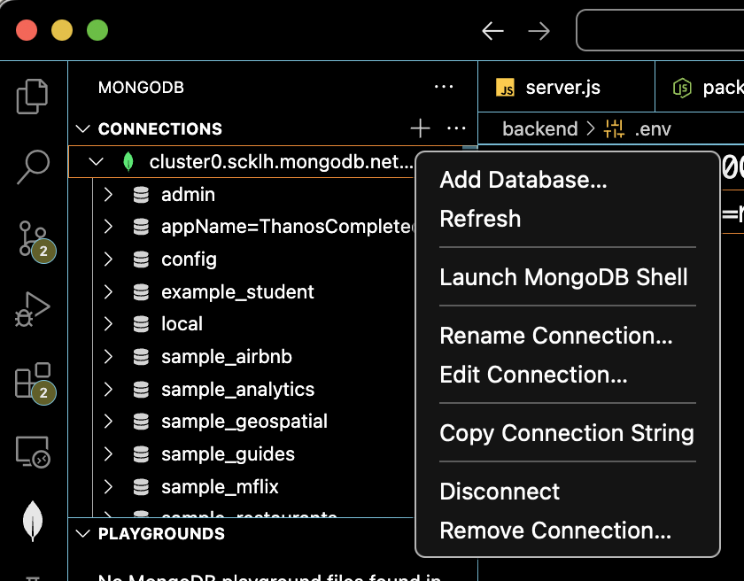

## Initial Commit  🇺🇸
```
mkdir CPA325.1CapstoneProject
mkdir 
    CPA325.1CapstoneProject/frontend 
    CPA325.1CapstoneProject/backend
cd CPA325.1CapstoneProject
    git init at this level
    git add .
    git commit -m ''
    git remote add origin <repo>
    where <repo> = https://github.com/MM-BYC/CPA325.1CapstoneProject
    git push -u origin main
```
## Backend 
[ ✅ ] Create Server 

```
1. cd backend
    ▶️ npm init -y
    ▶️ npm i express mongoose dotenv nodemon   
    
2. create server.js
   ▶️ const express= require('express')
   ▶️ const app = express()
   ▶️ const PORT = process.env.PORT || 3000
   ▶️ app.listen(PORT,()=>{
        console.log(`Listening on port: ${PORT}`)
3. Edit package.json 
   ▶️ "start": "node server.js",
   ▶️ "dev"" "nodemon server.js"
4. create .env
   ▶️ PORT= 
5. Test server is running.
   ▶️ npm start
```
[ ✅ ] Test the Server

   

[ ✅ ] Establish Database
```
1. create folder config
    1.1. create file connectToDb
        ▶️ require("dotenv").config()
        ▶️ const mongoose = require('mongoose');
        ▶️ const connectToDb = async() => {
            await mongoose.connect(process.env.DB_URL);
            console.log(`DataBase_Connected`)
        }
        ▶️ module.exports = connectToDb
2. edit .env  
    Manually copy the connection string from mongoose
    ▶️ DB_URL=mongodb+srv://michaelmarquezusa:<password>@cluster0.scklh.mongodb.net/appName=capstoneProject 
```


```
3. edit server.js
    ▶️ const connectToDb = require('./config/connectToDb')
    ▶️ connectToDb()
4. create folder models
    4.1 create file user.js     
        // stores related user informations   
        ▶️ const mongoose = require("mongoose");
        ▶️ const Schema = mongoose.Schema;
        ▶️ const userSchema = new Schema({
            role: {type: String,enum: ["admin", "user"]},
            name: {type: String, required: true},
            email: {type: String, unique: true},
            password: {type: String, minlength: 6}
        })

    4.2 create file opendate.js
    // stores related booked informations   
        ▶️ const mongoose = require("mongoose");
        ▶️ const Schema = mongoose.Schema;
        ▶️ const userSchema = new Schema({

            })
        ▶️ const User = mongoose.model("user", userSchema);
        ▶️ module.exports = User;

[ ✅ ] Make Controllers
```
1. create folder controllers
    1.1 create openController.js
    
    1.2 create userController.js
```

[ ✅ ] Make Routes
```
1. create folder routes
    1.1 Create file userRoute.js

    1.2 Create file openRoute.js
```

## Frontend

[ ✅ ] Install React, cors 

```
1. cd frontend
    1.1. npm create vite@latest .
    1.2. npm install
    1.3. npm run dev 
2.  Connect frontend and backend with:
    2.1. Proxy goes to the frontend
        "proxy": "http://localhost:3000",
        2.2. Go to the Backend
        2.2.1.  npm install cors
        2.2.2.  Backend server.js include
                const cors = require('cors')
                app.use(
                cors({
                    origin: true,
                    credentials: true,
                }));  
```

